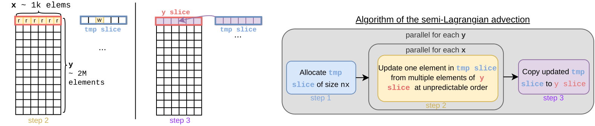

# Parallel Advection

This code implements a 1D advection operator inside a multidimensionnal space. It implements a [semi-Lagrangian scheme](https://en.wikipedia.org/wiki/Semi-Lagrangian_scheme) using the [SYCL 2020](https://registry.khronos.org/SYCL/specs/sycl-2020/html/sycl-2020.html) progamming models.

## General algorithm
For one time step, this is the algorithm's structure:



### SYCL Implementations
Impls (folder `src/core/impl`):
- Basic Range2D
- Basic Range1D
- ND-Range
- Hierarchical
- Scoped

# Build the project (see instructions on branches):
You can use the `compile.sh` script to compile for various hardware and sycl-implementations. Try `compile.sh --help` to see available options.

## Manually build the project
Flags depends on the SYCL implementation you are using.
- For DPC++, add the correct flags via the `-DDPCPP_FSYCL_TARGETS` cmake variable.
- For acpp, export the `ACPP_TARGETS` environment variable before compiling
```sh
mkdir build
cd build
cmake .. -DCMAKE_CXX_COMPILER=/path/to/sycl/compiler
make
```

# Running benchmarks
## Prerequisites
- Apptainer/Singularity or Docker must be installed on the machine.
- Pull the [sycl-complete container](https://github.com/Maison-de-la-Simulation/parallel-advection/pkgs/container/sycl-complete).
  - `apptainer pull docker://ghcr.io/maison-de-la-simulation/sycl-container:llvm-16`
- Build [google benchmark](https://github.com/google/benchmark) library apart (can be built in the submodule folder `thirdparty/benchmark`).
- A cluster with SLURM scheduler?

## Instructions
Once the prerequisites are fullfiled:
- Compile the `parallel-advection` project with -Dbenchmark_DIR option (`./compile.sh --benchmark_DIR=/path/to/build/benchmark`).

Now that the project is compiled, you must choose which benchmark to run.

- Main benchmarks are in `main_bench.cpp`


- Use the `BENCHMARK_FILTER` environment variable to target different benchmarks. `--benchmark-filter=BM_Advector/0 or BM_Advector/1` (0 for CPU 1 for GPU)
## Full example: A100 GPU with AdaptiveCpp
```sh
# Once container is pulled
# Inside parallel-advection folder
git clone parallel-advection
cd parallel-advection
git submodule --init update #pull google benchmark

apptainer pull docker://ghcr.io/maison-de-la-simulation/sycl-container:llvm-16
export APPTAINER_BIND="parallel-advection:/par-adv"
apptainer shell sycl-container_llvm-16.sif
#inside container
cd /par-adv/thirdparty/benchmark
mkdir build && cmake .. -D.... #compile google benchmark apart
cd /par-adv
./compile.sh --hw a100 --sycl acpp --benchmark_DIR /par-adv/thirdparty/benchmark/build
#main executable is build_a100_acpp/src/advection
exit #get out of the container

#On a cluster with SLURM,
vi diag/launch_benchmarks.sh #Update values for SLURM scheduler and correct values for benchmark (here we target a100 and acpp, we will need the --nv flag for singularity)
sbatch launch_benchmarks.sh #run the benchmarks for A100
```

To visualize the results with  python pandas and matplotlib:
```python
from utils.py import * #import diag/utils.py functions to vizualise
df_acpp_a100 = get_cleaned_df("LOGS/A100/a100_acpp_50rep.json") #turn json into DataFrame
a100_acpp = create_dict_from_df(df_acpp_a100) #turn DataFrame into a easily plotable list
plot_values(a100_acpp, "A100 GPU ACPP", do_show=true) #plot the values and show
```


# Run the executable
1. Set the runtime parameters in `build/.../advection.ini`

```ini
[run]
# Total number of iterations
maxIter = 200
# Wheter to run on the GPU or CPU #only for SYCL
gpu     = true
# The kernel type to use for Xadvection
kernelImpl  = Hierarchical  
# Size of work groups use in the kernels
workGroupSize = 32
# Outputs a solution.log file to be read with the python notebook
outputSolution = false

[geometry]
nx  = 1024 # nb of spatial points
nvx = 2 # nb of speed points
n_fict_dim = 1  # nb of points in the fictive dimension

[discretization]
dt  = 0.001

minRealX  = 0
maxRealX  = 1
minRealVx = -1
maxRealVx = 1
```

Deltas $d_{vx}$ and $d_x$ are deduced by the number of points and min/max values.

2. Run the executable `build/src/.../advection`


### Credits
This code is largely inspired by the [vlp4D](https://github.com/yasahi-hpc/vlp4d) code
