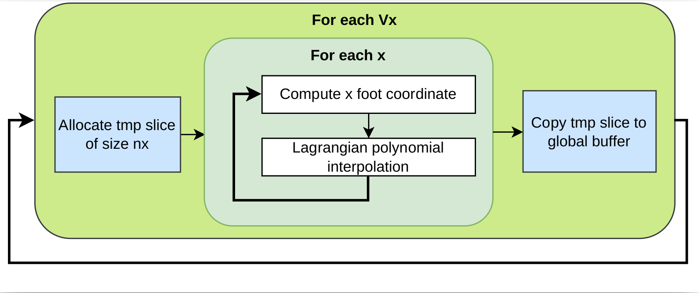

# Parallel Advection

## General algorithm
The following is the advection operator algorithm for one time-step:



TODO: fill README 

# Kernels
- Basic Range
  - 1D
  - 2D
- ND-Range
- Hierarchical
- Scoped
- ...

### To build the project:
```sh
mkdir build
cd build
cmake .. -DCMAKE_CXX_COMPILER=/path/to/sycl/compiler
make
```


# Credits
This code is largely inspired by the [vlp4D](https://github.com/yasahi-hpc/vlp4d) code