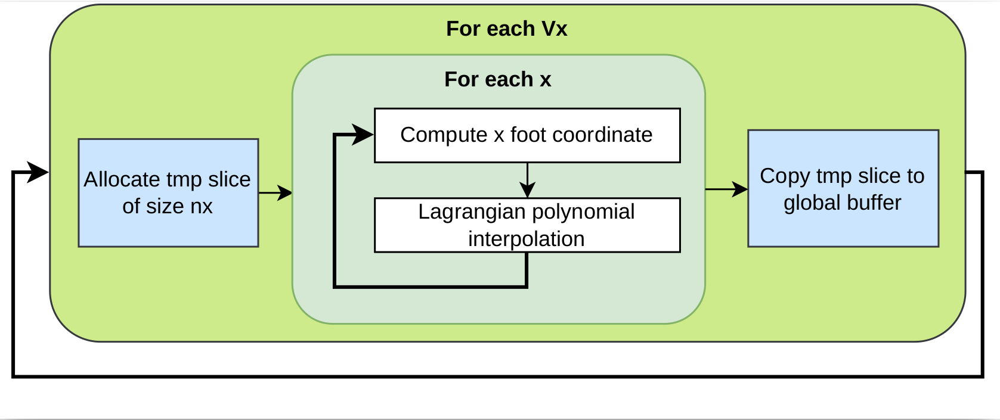

# Parallel Advection

## General algorithm
The following is the advection operator algorithm for one time-step:



TODO: fill README 

# Kernels
- Basic Range
  - 1D
  - 2D
- ND-Range
- Hierarchical
- Scoped
- ...

### To build the project:
```sh
mkdir build
cd build
cmake -DBACKEND={sycl/kokkos} <more flags> ..
make
```

+ If compiling with `-DBACKEND=sycl` add the `-DCMAKE_CXX_COMPILER=/path/to/sycl/compiler`
+ If compiling with `-DBACKEND=kokkos`, add the proper flags (e.g., `-DKokkos_ENABLE_CUDA=ON` `-DKokkos_ARCH_AMPERE80=ON`)


# Credits
This code is largely inspired by the [vlp4D](https://github.com/yasahi-hpc/vlp4d) code